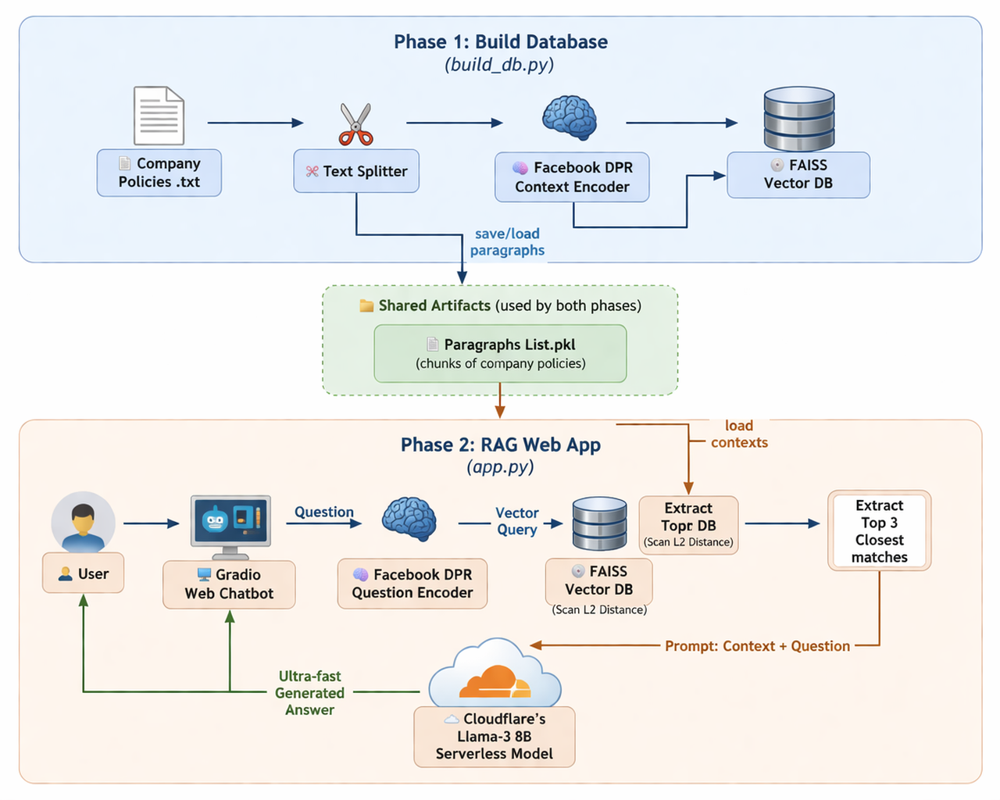

# 🏢 Serverless HR Bot (RAG system via Cloudflare AI)


An automated Retriever-Augmented Generation (RAG) Question-Answering system designed to analyze and extract information from internal company documents (policies, rules, etc.). This application implements an advanced RAG architecture, combining a **FAISS Vector Database**, **Facebook DPR (Dense Passage Retriever)**, and the **Llama-3 LLM via Cloudflare Workers AI** for a completely serverless generation experience.

---

## ⚙️ Architecture Diagram


The system is designed with a CI/CD standard that separates the offline data processing pipeline from the online querying web app, fully optimizing hardware performance and cost.

---

## 🛠️ Local Installation & Setup

**Step 1: Install core dependencies**
Open your terminal in this directory and run:
```bash
pip install -r requirements.txt
```

**Step 2: Configure Cloudflare API**
Create a `.env` file in the root directory and securely insert your Cloudflare Workers AI credentials:
```env
CF_ACCOUNT_ID=your_cloudflare_account_id_here
CF_API_TOKEN=your_cloudflare_api_token_here
CF_MODEL_ID=@cf/meta/llama-3-8b-instruct
```

**Step 3: Build the Vector Database initially (Data Processing)**
You only need to run this command once to embed the text into vectors context database:
```bash
python build_db.py
```

**Step 4: Launch the Chatbot Interface**
```bash
python app.py
```
> 👉 *Open your browser to the local URL 127.0.0.1:7860 printed in the terminal.*

---

## 🚀 CI/CD Automation (Deploy to Hugging Face Spaces)

**Important:** Do not commit the `*.faiss` & `*.pkl` binary files to Github to avoid bloating your repository history (these are already ignored via `.gitignore`).

To deploy this web app permanently to the internet:
1. Push your Python source files to the `main` branch of this Repository.
2. Github Actions will automatically trigger a virtual machine workflow to download the dataset, execute `build_db.py`, generate the FAISS database internally, and push the entire compiled package directly to the **Hugging Face Spaces** servers.
3. Make sure you configure the `HF_TOKEN` Repository Secret on Github and adjust the `HF_SPACE` environment variable within the `/.github/workflows/deploy.yml` file to finalize your CI/CD pipeline.
